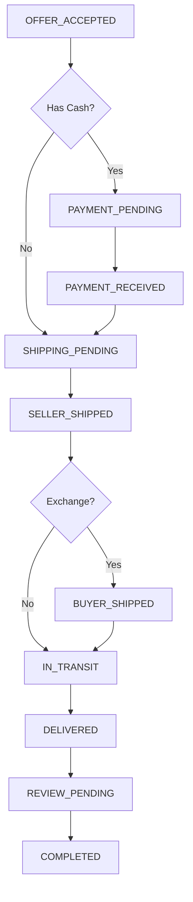

# Transaction System Implementation Guide

## 🎯 Overview

A comprehensive post-offer transaction system has been implemented for the Flip marketplace. This system handles the complete flow from offer acceptance through payment, shipping, delivery confirmation, and user reviews.

---

## 📂 File Structure

```
app/
├── types/
│   └── transaction.ts                 # All transaction-related types and interfaces
├── services/
│   ├── transaction.service.ts         # Transaction CRUD and management
│   └── shipping.service.ts             # GIG Logistics integration
├── (user)/(pages)/
│   └── transaction/[id]/
│       └── page.tsx                    # Transaction page route
├── ui/
│   ├── wrappers/
│   │   ├── TransactionHub.tsx         # Main transaction hub wrapper
│   │   └── ManageItemDetail.tsx       # Updated with transaction creation
│   └── transaction/
│       ├── TransactionItems.tsx        # Display items being exchanged
│       ├── TransactionStatusTimeline.tsx # Status timeline component
│       ├── PaymentSection.tsx          # Payment handling
│       ├── ShippingSection.tsx         # Shipping with GIG Logistics
│       └── ReviewModal.tsx             # Post-transaction review
```

---

## 🔄 Transaction Flow

### 1. **Offer Acceptance** (Seller)
- Seller accepts an offer in `/manage-item/[id]`
- System creates transaction record
- Determines transaction type automatically:
  - `CASH_ONLY`: Direct purchase
  - `ITEM_EXCHANGE`: Item for item swap
  - `ITEM_PLUS_CASH`: Item + cash combination
  - `AUCTION_WIN`: Auction winner
- Redirects both parties to `/transaction/[id]`

### 2. **Payment Phase** (Buyer)
**Applicable for:** `CASH_ONLY`, `ITEM_PLUS_CASH`, `AUCTION_WIN`

- Buyer selects payment method (Paystack/Bank Transfer)
- Payment held in escrow
- Seller notified when payment received
- Status: `PAYMENT_PENDING` → `PAYMENT_RECEIVED`

### 3. **Shipping Phase**
**Seller ships first**, then buyer (for exchanges):

- Arrange shipping with GIG Logistics
- Enter pickup/delivery addresses
- System generates waybill
- Real-time tracking available
- Status: `SHIPPING_PENDING` → `SELLER_SHIPPED` → `IN_TRANSIT` → `DELIVERED`

For `ITEM_EXCHANGE`, buyer ships after seller ships:
- Status: `SELLER_SHIPPED` → `BUYER_SHIPPED` → `IN_TRANSIT` → `DELIVERED`

### 4. **Delivery Confirmation** (Buyer)
- Buyer confirms item received in good condition
- Triggers escrow release (if payment involved)
- Status: `DELIVERED` → `REVIEW_PENDING`

### 5. **Review & Completion**
- Both parties leave reviews and ratings
- Transaction marked complete
- Status: `REVIEW_PENDING` → `COMPLETED`

---

## 🎨 Components

### **TransactionHub** (`/transaction/[id]`)
Main transaction management interface with three tabs:

#### **Overview Tab**
- Display both items being exchanged
- Show buyer/seller information with ratings
- Real-time status timeline
- Transaction summary sidebar

#### **Payment Tab** (if applicable)
- Payment method selection
- Escrow information
- Payment status tracking
- Receipt display

#### **Shipping Tab**
- Arrange pickup with GIG Logistics
- Enter shipping details
- Track shipment in real-time
- View delivery history

### **Key Features**
- 📱 **Mobile responsive** with collapsible sections
- 🔄 **Auto-refresh** every 30 seconds
- 🎯 **Context-aware actions** based on user role and status
- 🔐 **Escrow protection** indicators
- ⏱️ **Real-time status** updates

---

## 📊 Transaction Types Explained

### 1. **CASH_ONLY**
Direct purchase without item exchange.
```
Flow: Accept → Pay → Ship → Confirm → Review
Parties: Seller ships to Buyer
Payment: Required
```

### 2. **ITEM_EXCHANGE**
Pure item-for-item swap.
```
Flow: Accept → Both Ship → Confirm → Review
Parties: Both ship items simultaneously
Payment: None
```

### 3. **ITEM_PLUS_CASH**
Item exchange with additional cash.
```
Flow: Accept → Pay Cash → Both Ship → Confirm → Review
Parties: Both ship, buyer pays difference
Payment: Required (difference amount)
```

### 4. **AUCTION_WIN**
Winner of live auction.
```
Flow: Win → Pay → Seller Ships → Confirm → Review
Parties: Winner pays, seller ships
Payment: Required (winning bid)
```

---

## 🚚 GIG Logistics Integration

### Features Implemented
- ✅ Shipment creation with waybill generation
- ✅ Pickup scheduling
- ✅ Real-time tracking
- ✅ Delivery confirmation
- ✅ Estimated delivery dates
- ✅ Shipping cost calculation

### Shipping Service Methods
```typescript
ShippingService.createShipment(data)
ShippingService.trackShipment(waybillNumber)
ShippingService.schedulePickup(data)
ShippingService.getShippingQuote(data)
ShippingService.confirmDelivery(waybillNumber)
```

### Required Information
- Sender: Name, phone, address, state, LGA
- Receiver: Name, phone, address, state, LGA
- Item: Description, value, weight
- Delivery type: Standard/Express/Priority
- Payment: Prepaid/COD

---

## 💳 Payment Integration

### Payment Flow
1. **Initialize Payment**
   ```typescript
   TransactionService.initializePayment({
     transactionId,
     amount,
     paymentMethod,
     callbackUrl
   })
   ```

2. **Escrow Protection**
   - Payment held until delivery confirmed
   - Automatic release on confirmation
   - Refund support for disputes

3. **Payment Methods**
   - Card (Paystack)
   - Bank Transfer
   - Future: Wallet, USSD

### Payment States
- `PENDING`: Awaiting payment
- `PROCESSING`: Payment in progress
- `IN_ESCROW`: Held securely
- `COMPLETED`: Released to seller
- `FAILED`: Payment failed
- `REFUNDED`: Returned to buyer

---

## ⭐ Review System

### Review Modal Features
- Star rating (1-5)
- Written review (min 10 characters)
- Quick suggestion tags
- User information display
- Community trust indicators

### Review API
```typescript
ReviewsService.createReview({
  rating: 1-5,
  message: string,
  userId: number
})
```

---

## 🔧 API Integration Required

The following backend endpoints need to be implemented:

### Transaction Endpoints
```
POST   /v1/transactions                 # Create transaction
GET    /v1/transactions/:id             # Get transaction details
GET    /v1/transactions/me              # Get user's transactions
PUT    /v1/transactions/:id/status      # Update status
PUT    /v1/transactions/:id/complete    # Mark complete
PUT    /v1/transactions/:id/cancel      # Cancel transaction
```

### Shipping Endpoints
```
POST   /v1/transactions/shipping                    # Create shipping
PUT    /v1/transactions/shipping/:id                # Update shipping
GET    /v1/transactions/shipping/:id                # Get shipping details
POST   /v1/transactions/shipping/:id/schedule-pickup
GET    /v1/transactions/shipping/track/:waybill
PUT    /v1/transactions/:id/confirm-delivery
```

### Payment Endpoints
```
POST   /v1/transactions/payment/initialize    # Initialize payment
POST   /v1/transactions/payment/verify        # Verify payment
GET    /v1/transactions/payment/:id           # Get payment details
PUT    /v1/transactions/:id/release-escrow    # Release escrow
POST   /v1/transactions/:id/refund            # Request refund
```

### GIG Logistics Endpoints (External API Integration)
```
POST   /v1/shipping/gig/create           # Create shipment
POST   /v1/shipping/gig/quote            # Get shipping quote
GET    /v1/shipping/gig/track/:waybill   # Track shipment
POST   /v1/shipping/gig/schedule-pickup  # Schedule pickup
POST   /v1/shipping/gig/cancel           # Cancel shipment
```

---

## 🎯 Transaction Status Flow



---

## 📱 User Experience Highlights

### Seller Experience
1. Accept offer → Transaction created
2. Wait for payment (if applicable)
3. Arrange shipping with GIG
4. Track delivery status
5. Receive payment after confirmation
6. Leave review for buyer

### Buyer Experience
1. Offer accepted → Redirected to transaction
2. Make payment (if applicable)
3. Wait for seller to ship
4. Ship item (if exchange)
5. Track both shipments
6. Confirm delivery
7. Leave review for seller

---

## 🔐 Security Features

### Escrow Protection
- Payment held until delivery confirmed
- Protects both buyer and seller
- Automatic release mechanism
- Dispute resolution support

### Transaction Integrity
- Status validation at each step
- Role-based action permissions
- Cancellation only in early stages
- Audit trail via timeline

### Data Protection
- Sensitive info only to parties involved
- Secure payment gateway integration
- Encrypted data transmission

---

## 🚀 Testing Checklist

### Unit Testing
- [ ] Transaction type determination
- [ ] Status progression logic
- [ ] Payment calculation
- [ ] User role permissions

### Integration Testing
- [ ] Offer acceptance → Transaction creation
- [ ] Payment gateway integration
- [ ] GIG Logistics API calls
- [ ] Review submission

### E2E Testing Scenarios

#### Scenario 1: Cash Purchase
1. Seller accepts cash offer
2. Buyer makes payment
3. Seller arranges shipping
4. Buyer confirms delivery
5. Both leave reviews

#### Scenario 2: Item Exchange
1. Seller accepts item exchange offer
2. Seller ships item first
3. Buyer ships item
4. Both confirm delivery
5. Both leave reviews

#### Scenario 3: Item + Cash
1. Seller accepts mixed offer
2. Buyer pays cash portion
3. Both arrange shipping
4. Both confirm delivery
5. Reviews completed

---

## 📈 Future Enhancements

### Phase 2 Features
- [ ] Dispute resolution system
- [ ] Insurance options
- [ ] Multiple payment methods (wallet, USSD)
- [ ] Bulk transaction management
- [ ] Transaction history export
- [ ] Push notifications
- [ ] Email notifications
- [ ] SMS updates via GIG
- [ ] In-app messaging during transaction
- [ ] Photo upload for delivery confirmation
- [ ] Digital signature capture
- [ ] Transaction analytics dashboard
- [ ] Seller performance metrics
- [ ] Buyer reputation system

### Advanced Features
- [ ] Escrow time limits
- [ ] Automatic refunds
- [ ] Partial payments
- [ ] Installment options
- [ ] Group purchases
- [ ] International shipping
- [ ] Multi-currency support

---

## 🐛 Troubleshooting

### Common Issues

**Transaction not creating:**
- Check user authentication
- Verify offer data structure
- Ensure API endpoint exists

**Payment not processing:**
- Confirm payment gateway credentials
- Check callback URL configuration
- Verify amount and currency

**Shipping not working:**
- Validate GIG API credentials
- Check address format
- Ensure all required fields provided

**Status not updating:**
- Verify WebSocket/polling working
- Check API response format
- Confirm status transition rules

---

## 📞 Support & Maintenance

### Monitoring
- Track transaction completion rates
- Monitor payment success rates
- Alert on shipping delays
- Review cancellation patterns

### Metrics to Track
- Average time to completion
- Payment failure rate
- Shipping success rate
- Review submission rate
- User satisfaction scores

---

## 📝 Notes for Backend Team

### Priority 1 (Core Functionality)
1. Implement transaction CRUD endpoints
2. Set up payment gateway integration (Paystack)
3. Configure GIG Logistics API
4. Create webhook handlers for payments

### Priority 2 (Enhanced Features)
1. Escrow management system
2. Email/SMS notifications
3. Real-time status updates
4. Transaction analytics

### Priority 3 (Advanced)
1. Dispute resolution
2. Fraud detection
3. Performance optimization
4. Advanced reporting

---

## 🎓 Developer Guide

### Adding a New Transaction Type
1. Add type to `TransactionType` enum in `types/transaction.ts`
2. Update status flow logic in `TransactionService`
3. Add UI handling in `TransactionHub`
4. Update documentation

### Modifying Status Flow
1. Update `TransactionStatus` enum
2. Modify `getExpectedStatuses()` in `TransactionStatusTimeline`
3. Update `getNextAction()` in `TransactionService`
4. Test all transaction types

### Customizing UI
- Colors: Defined in Tailwind classes
- Typography: Using `typo-*` classes from design system
- Spacing: Following existing pattern (`mx-[120px] xs:mx-0`)
- Components: All use existing UI components

---

## ✅ Implementation Complete

All core transaction flow functionality has been implemented:

✅ Transaction types and interfaces
✅ Transaction and shipping services
✅ Complete transaction hub UI
✅ Payment integration (ready for gateway)
✅ GIG Logistics shipping integration (ready for API)
✅ Real-time status tracking
✅ Review and rating system
✅ Mobile-responsive design
✅ Escrow protection indicators
✅ Comprehensive error handling

**Ready for backend integration and testing!**

---

## 📧 Questions?

For implementation questions or clarification:
- Review the code comments in each file
- Check TypeScript types for data structures
- Refer to existing UI patterns in the codebase

**Happy Coding! 🚀**
